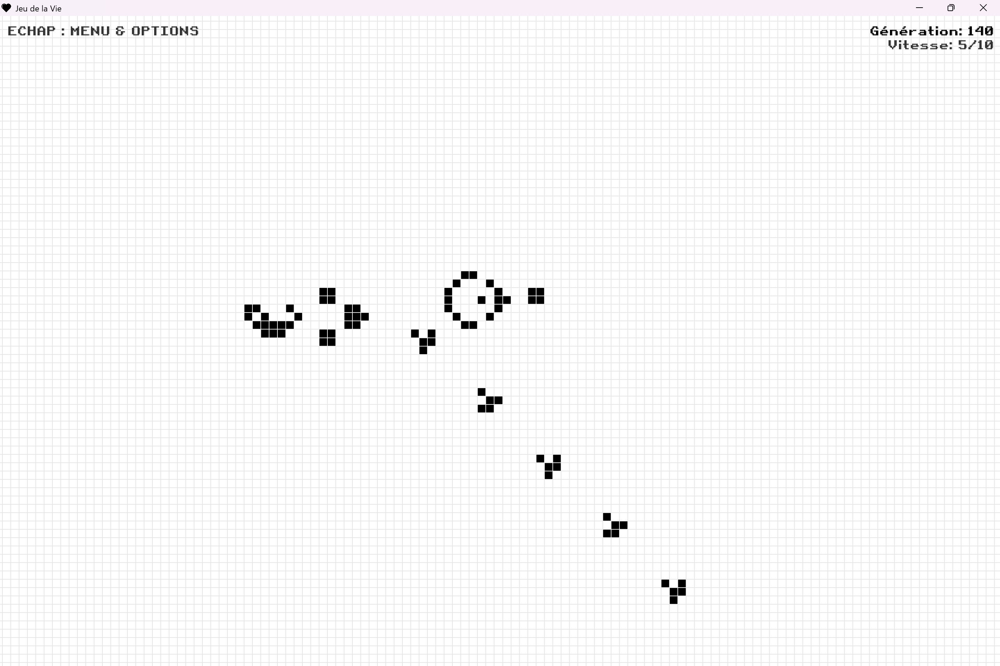
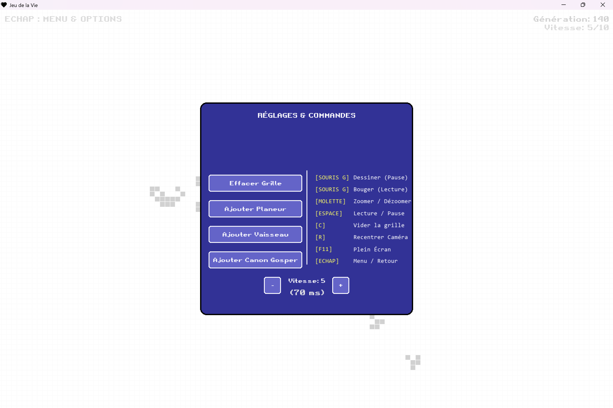

# 🧬 Jeu de la Vie - Édition Grille Infinie


Une implémentation optimisée du célèbre automate cellulaire de John Conway, réalisée en Python avec Pygame. Ce projet se distingue par l'utilisation d'une **grille infinie** et d'un algorithme de gestion de mémoire efficace.

## Aperçu du jeu : 






## ✨ Fonctionnalités

* **Univers Infini :** Pas de murs, pas de limites. L'univers s'étend aussi loin que la mémoire de votre ordinateur le permet.
* **Caméra Dynamique :** Déplacement (Pan) et Zoom via la souris pour naviguer dans l'espace infini.
* **Contrôle du Temps :** Accélérez ou ralentissez la simulation, ou mettez-la en pause pour dessiner.
* **Bibliothèque de Motifs :** Insertion rapide de structures connues (Planeurs, Vaisseaux, Canons...) via un menu interactif.
* **Interface Intuitive :** Menu de réglages, HUD d'informations et raccourcis clavier.
* **Détection de Stagnation :** Le jeu détecte automatiquement si l'univers est figé et se réinitialise après un délai.

## 🛠️ Installation

1.  **Cloner le dépôt :**
    ```bash
    git clone [https://github.com/DimiZorgon/jeu-de-la-vie.git]
    cd jeu-de-la-vie
    ```

2.  **Installer les dépendances :**
    Ce projet nécessite uniquement `pygame`.
    ```bash
    pip install pygame
    ```

3.  **Lancer le jeu :**
    ```bash
    python main.py
    ```

## 🎮 Commandes

| Touche / Action | Effet |
| :--- | :--- |
| **Souris (Gauche)** | Dessiner des cellules (en Pause) / Déplacer la caméra (en Lecture) |
| **Molette Souris** | Zoomer / Dézoomer |
| **ESPACE** | Mettre en Pause / Reprendre la lecture |
| **ECHAP** | Ouvrir le **Menu** (Réglages, Motifs, Vitesse) |
| **F11** | Activer / Désactiver le Plein Écran |
| **C** | Vider la grille (Clear) |
| **R** | Recentrer la caméra à l'origine (0,0) |


### Structure des fichiers
* `main.py` : Gestion de la boucle de jeu, des événements (Inputs), de la caméra (Conversion Monde $\leftrightarrow$ Écran) et du rendu graphique.
* `grille.py` : Logique métier pure. Contient l'algorithme d'évolution.
* `assets/` : Contient la police et le logo

### Algorithme "Sparse" (Grille Creuse)
Contrairement aux implémentations classiques utilisant une matrice 2D fixe (Tableau `N x N`), ce projet utilise un `set()` (ensemble) stockant uniquement les coordonnées `(x, y)` des cellules vivantes.

**Avantages :**
1.  **Mémoire :** Une grille vide ne consomme rien, même si on dessine en position (1 milliard, 1 milliard).
2.  **Performance :** L'algorithme ne parcourt pas toute la grille, mais utilise un **dictionnaire de fréquences** pour ne tester que les cellules actives et leurs voisins immédiats.

```python
# Extrait de la logique d'optimisation
compteur_voisins = collections.defaultdict(int)
for cellule in cellules_vivantes:
    for voisin in get_voisins(cellule):
        compteur_voisins[voisin] += 1
# On ne traite que les cellules présentes dans ce dictionnaire
